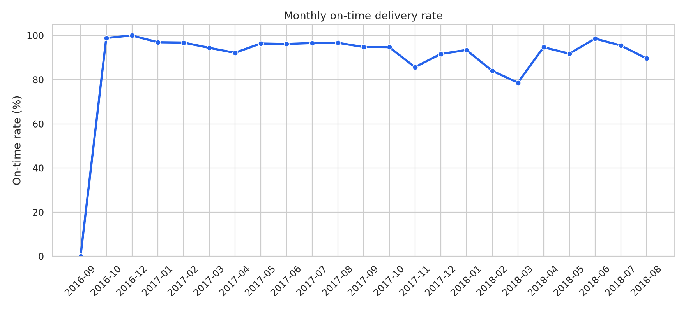
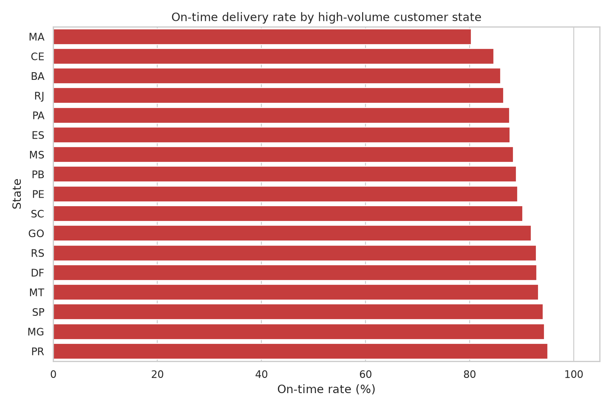
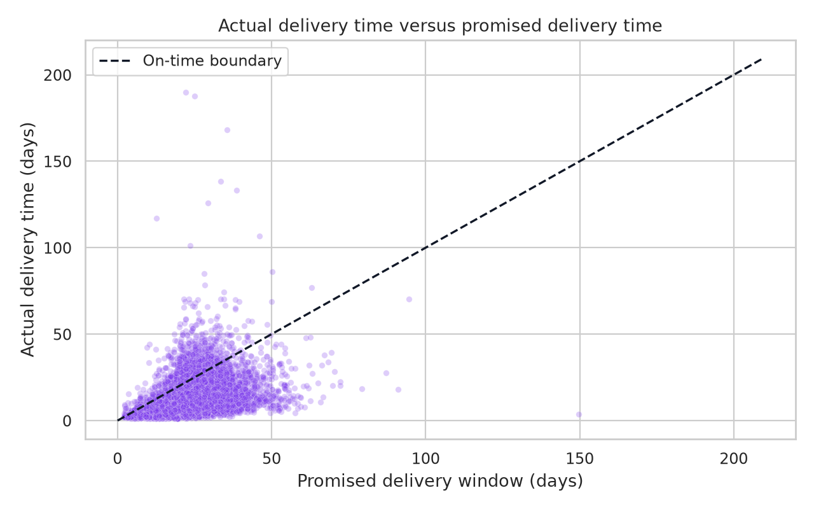

# Operations and Delivery Performance Dashboard

A reproducible e-commerce operations analysis using the Brazilian E-Commerce Public Dataset by Olist. The project measures delivery reliability, promised-versus-actual performance, cancellations, freight-cost exposure, and regional variation.

> **Portfolio focus:** operational KPI design, SLA analysis, root-cause prioritization, SQL, Python, data visualization, and Power BI dashboard planning.

## Executive summary

The analysis covers **99,441 orders** from the Olist sample. Of these, **96,478 were delivered** and **625 were canceled**. Delivered orders achieved a **91.88% on-time delivery rate**. The average delivery took **12.56 days**, while late orders were late by an average of **9.55 days**.

| Metric | Result |
|---|---:|
| Orders analyzed | 99,441 |
| Delivered orders | 96,478 |
| Canceled orders | 625 |
| Cancellation rate | 0.63% |
| On-time delivery rate | 91.88% |
| Late deliveries | 7,834 |
| Average delivery time | 12.56 days |
| Average delay among late orders | 9.55 days |
| Average freight share of payment value | 20.89% |
| Total payment value | $16,008,872.12 |

## Key findings

### Delivery reliability is strong overall, but late orders are materially late

The delivered-order on-time rate is **91.88%**, which means that approximately one in twelve delivered orders missed the estimated delivery date. Late orders were delayed by an average of **9.55 days**, making delay severity an important operational KPI in addition to the on-time percentage.

### Regional performance varies substantially

Among states with at least 100 delivered orders, **Alagoas (AL)** has the lowest on-time rate at **76.07%** and an average delivery time of **24.54 days**. **Maranhão (MA)** and **Ceará (CE)** also have lower reliability and longer delivery times. These locations should be prioritized for carrier, seller, and lane-level investigation.

São Paulo (SP), Minas Gerais (MG), Paraná (PR), and Rio Grande do Sul (RS) combine high order volume with on-time rates above **92%**. High-volume regions provide useful operational benchmarks, but their performance should not be generalized to low-volume states.

### Performance weakened during several high-volume months

Monthly on-time delivery fell to **85.68% in November 2017**, **84.01% in February 2018**, and **78.64% in March 2018**. These periods should be reviewed for seasonality, carrier capacity, seller processing times, and changes in order mix.

### Freight cost is a meaningful customer-value component

Freight represents an average of **20.89%** of payment value among delivered orders. The share is higher in several lower-performing states, including Maranhão at **29.95%**, which suggests that delivery reliability and shipping economics should be managed together rather than as separate workstreams.

## Visual findings

### Monthly on-time delivery rate



### Regional on-time delivery rate



### Actual versus promised delivery time



## Recommended business actions

| Priority | Action | Measurement |
|---|---|---|
| 1 | Investigate AL, MA, PI, and CE by carrier, seller, and delivery lane. | On-time rate, average delay, and complaint rate |
| 2 | Create peak-period capacity plans for November through March. | Monthly SLA rate and late-order backlog |
| 3 | Separate “late frequency” from “late severity” in operations reviews. | On-time rate and average days late |
| 4 | Review freight pricing and carrier coverage in high-freight states. | Freight share, delivery time, and conversion |
| 5 | Use high-performing SP, MG, PR, and RS lanes as operational benchmarks. | Benchmark-adjusted improvement by region |

## Methodology and limitations

The analysis joins order, customer, order-item, payment, and seller-related operational data at the order level. Delivery metrics are calculated only for orders with `order_status = delivered` and valid purchase, delivered-customer, and estimated-delivery timestamps. An order is considered on time when the customer delivery timestamp is on or before the estimated delivery timestamp.

The dataset represents an anonymized historical marketplace sample from Brazil. It does not include a complete carrier identifier or a direct customer-service ticket table, so regional patterns cannot by themselves establish the cause of delay. Low-volume state comparisons are filtered in the SQL output, and the dashboard specification recommends minimum-volume thresholds.

Freight share is calculated as freight value divided by total payment value. It is a cost-exposure indicator, not a profit margin measure. A production dashboard should add carrier, seller, warehouse, product category, and support-contact fields where available.

## Reproduce the analysis

```bash
git clone https://github.com/vaibhavdohale759-oss/operations-delivery-performance.git
cd operations-delivery-performance
python -m pip install -r requirements.txt
python src/analyze_operations.py
```

The script creates a cleaned order-level dataset, SQLite-ready outputs, CSV summaries, and PNG charts in `reports/` and `figures/`.

## Repository structure

```text
operations-delivery-performance/
├── data/
│   ├── olist_customers_dataset.csv
│   ├── olist_order_items_dataset.csv
│   ├── olist_order_payments_dataset.csv
│   ├── olist_orders_dataset.csv
│   └── ...
├── figures/
│   ├── actual_vs_promised_delivery.png
│   ├── monthly_on_time_rate.png
│   └── state_on_time_rate.png
├── reports/
│   ├── monthly_delivery.csv
│   ├── state_performance.csv
│   ├── status_summary.csv
│   ├── cleaned_order_operations.csv
│   └── summary_metrics.csv
├── sql/
│   └── operations_analysis.sql
├── src/
│   └── analyze_operations.py
├── POWER_BI_DASHBOARD_SPEC.md
├── README.md
└── requirements.txt
```

## Dataset and references

The Brazilian E-Commerce Public Dataset by Olist contains approximately 100,000 anonymized orders from 2016–2018 and includes order status, timestamps, customer locations, items, payments, and freight information.[1] The dataset is distributed publicly through Kaggle.[2]

## Author

**Vaibhav Dohale** — aspiring data analyst focused on Python, SQL, Power BI, and business analytics.

[1]: https://github.com/ayushic2899/Brazilian-E-Commerce-Public-Dataset-by-Olist "Brazilian E-Commerce Public Dataset by Olist project documentation"
[2]: https://www.kaggle.com/datasets/olistbr/brazilian-ecommerce "Brazilian E-Commerce Public Dataset by Olist"
